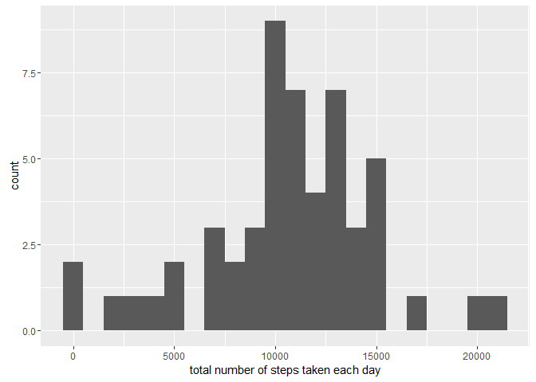

Reproducible Research: Peer Assessment 1
========================================

### Loading and preprocessing the data

``` r
unzip(zipfile="repdata-data-activity.zip")
data <- read.csv("activity.csv")
head(data)
```

    ##   steps       date interval
    ## 1    NA 2012-10-01        0
    ## 2    NA 2012-10-01        5
    ## 3    NA 2012-10-01       10
    ## 4    NA 2012-10-01       15
    ## 5    NA 2012-10-01       20
    ## 6    NA 2012-10-01       25

Let's transform the date column to a date format, and the interval to hours-minutes. Note that the interval column is in the format, hm. This means it jumps from 50, 55, to 100.

``` r
data$date <- as.Date(data$date, format ="%Y-%m-%d")
head(data)
```

    ##   steps       date interval
    ## 1    NA 2012-10-01        0
    ## 2    NA 2012-10-01        5
    ## 3    NA 2012-10-01       10
    ## 4    NA 2012-10-01       15
    ## 5    NA 2012-10-01       20
    ## 6    NA 2012-10-01       25

What is mean total number of steps taken per day?
=================================================

``` r
stepsDay <- aggregate(steps ~ date, data = data, sum, na.rm = TRUE)
head(stepsDay)
```

    ##         date steps
    ## 1 2012-10-02   126
    ## 2 2012-10-03 11352
    ## 3 2012-10-04 12116
    ## 4 2012-10-05 13294
    ## 5 2012-10-06 15420
    ## 6 2012-10-07 11015

### The total number of steps taken per day

``` r
library(ggplot2)
#total.steps <- tapply(data$steps, data$date, FUN=sum, na.rm=TRUE)
qplot(stepsDay$steps,geom="histogram", binwidth = 1000, xlab = "total number of steps taken each day")
```

<!-- -->

``` r
mean(stepsDay$steps, na.rm=TRUE)
```

    ## [1] 10766.19

``` r
median(stepsDay$steps, na.rm=TRUE)
```

    ## [1] 10765

What is the average daily activity pattern?
===========================================

``` r
library(ggplot2)
averages <- aggregate(x=list(steps=data$steps), by=list(interval=data$interval),FUN=mean, na.rm=TRUE) 
ggplot(data=averages, aes(x=interval, y=steps)) + geom_line() + xlab("5-minute interval") + ylab("average number of steps taken")
```

<!-- -->

On average across all the days in the dataset, the 5-minute interval contains the maximum number of steps?

``` r
averages[which.max(averages$steps), ]
```

    ##     interval    steps
    ## 104      835 206.1698

Imputing missing values
=======================

``` r
missing <- is.na(data$steps)
# How many missing
table(missing)
```

    ## missing
    ## FALSE  TRUE 
    ## 15264  2304

All of the missing values are filled in with mean value for that 5-minute interval.

``` r
# Replace each missing value with the mean value of its 5-minute interval
fill.value <- function(steps, interval) {
    filled <- NA
    if (!is.na(steps))
        filled <- c(steps)
    else
        filled <- (averages[averages$interval==interval, "steps"])
    return(filled)
}
filled.data <- data
filled.data$steps <- mapply(fill.value, filled.data$steps, filled.data$interval)
```

Now, using the filled data set, let's make a histogram of the total number of steps taken each day and calculate the mean and median total number of steps.

``` r
total.steps <- tapply(filled.data$steps, filled.data$date, FUN=sum)
qplot(total.steps, binwidth=1000, xlab="total number of steps taken each day")
```

<!-- -->

``` r
mean(total.steps)
```

    ## [1] 10766.19

``` r
median(total.steps)
```

    ## [1] 10766.19

Mean and median values are higher after imputing missing data. The reason is that in the original data, there are some days with steps values NA for any interval. The total number of steps taken in such days are set to 0s by default. However, after replacing missing steps values with the mean steps of associated interval value, these 0 values are removed from the histogram of total number of steps taken each day.

Are there differences in activity patterns between weekdays and weekends?
=========================================================================

First, let's find the day of the week for each measurement in the dataset. In this part, we use the dataset with the filled-in values.

``` r
weekday.or.weekend <- function(date) {
    day <- weekdays(date)
    if (day %in% c("Monday", "Tuesday", "Wednesday", "Thursday", "Friday")) 
        return("weekday") else if (day %in% c("Saturday", "Sunday")) 
        return("weekend") else stop("invalid date")
}
filled.data$date <- as.Date(filled.data$date)
filled.data$day <- sapply(filled.data$date, FUN = weekday.or.weekend)
```

Now, let's make a panel plot containing plots of average number of steps taken on weekdays and weekends.

``` r
averages <- aggregate(steps ~ interval + day, data = filled.data, mean)
ggplot(averages, aes(interval, steps)) + geom_line() + facet_grid(day ~ .) + xlab("5-minute interval") + ylab("Number of steps")
```

<!-- -->
